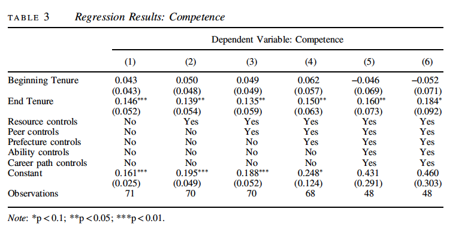

```{r setup, include=FALSE}
knitr::opts_chunk$set(echo = F)

library(stargazer)
library(tidyverse)
```

## Paper

How Chinese Officials Use the Internet to Construct Their
Public Image^[All analysis for this paper is available at https://github.com/michgao87/gov1006-milestones]

## Graphic
```{r}

# Read in relevant data 

yroff <- read.csv("rep-paper/readme_out_yroff.csv", header=TRUE)
tenure <- read.csv("rep-paper/readme_out_tenure.csv", header=TRUE)

# Set axes for graphs

yaxtloc <- c(0,.1,.2,.3,.4,.5)
laxtlab <- c("0%", "10%","20%","30%","40%","50%")
xaxtloc <- c(0,.2,.4,.6,.8,1)
lxaxtlab <- c("Beginning", "Middle","End")

# Fig 2: Proportion of web pages with content focused on competence

# Plot two graphs side by side

par(mfrow=c(1,2)) 

# First graph: Web pages for competence by year in office

plot(1:5, yroff[1:5,]$estimate,ylim=c(0,0.5), pch=16,
     xlab="Year in Office",ylab="% Web Pages for Competence",
     cex=1, cex.axis=0.8, cex.lab=1,yaxt="n")
axis(2, at= yaxtloc,labels= laxtlab, cex.axis=0.8)

# Create points on graph with confidence interval

for(i in 1:5){
	segments(i,yroff[i,]$lwr,i,yroff[i,]$upr, lwd=2)
}

# Second graph: web pages for competence by proximity to leaving office

plot(1:3, tenure[1:3,]$estimate,ylim=c(0,0.5), pch=16,
     xlab="Proximity to Leaving Office",ylab="% Web Pages for Competence",
     cex=1, cex.axis=1, cex.lab=1, xaxt="n",xlim=c(0.8,3.2),yaxt="n")
axis(2, at= yaxtloc,labels= laxtlab, cex.axis=0.8)
axis(1,at=c(1,2,3),labels= lxaxtlab,cex.axis=0.8)

# Create points on graph with confidence interval

for(i in 1:3){
	segments(i,tenure[i,]$lwr,i,tenure[i,]$upr, lwd=2)
}

# Add title that encompasses both graphs

title("Prop. of Chinese County Sites w/ Content Focused on Competence",
      outer = T, line = -1)

```
Note: Proportion of web pages with content focused on competence by year in office with 95 percent bootstrapped confidence intervals (left panel) and by proximity to leaving office, where Beginning refers to executives within six month of taking office, End refers to executives within six months of leaving office, and Middle everyone in between (right panel). Year 5 includes executives in their fifth and sixth years of office. (This graphic is a replication of one that appears in the original paper, where this description also appears.)

## Overview

Many Chinese counties have websites that contribute to online government transparency objectives by increasing the amount of publicly available information about lower-tier party officials. Pan runs automated text analysis of nearly 2 million county government webpages and conducts close reading of web content to draw conclusions about the way these local officials use the Internet to construct their own public images. Content mainly emphasizes two things--competence or benevolence. Pan then analyzes how political tenure in relation to website content. She finds that county officials at the beginning of their tenure emphasize their benevolence and concern towards citizens. Officials near the end of their tenure emphasize their competence by highlighting all they’ve achieved over the course of their tenure. These officials are not doing so to win re-election, but nevertheless they are responding to political incentives for career advancement. In a non-democracy, they use public appeals more so to strengthen their legitimacy to other political actors. Pan focuses on local government websites, so she acknowledges that this methodology overlooks other government-controlled media outlets such as TV stations and other social media platforms. First she uses language analysis algorithms to sort the content of millions of web pages. Having found from descriptive analysis of her dataset that there is a strong correlation between political tenure and public image, she then turns to predictive inference: trying to predict the proportion of webpages for each county government website dedicated to demonstrating either competence or benevolence from county executive tenure length. In her linear regressions, Pan also includes some control variables in areas such as county resources and county executive ability, to show that the relationship of interest is significant even with these controls in place. Pan suggests that the surprising finding from her study is that the Internet is primarily a vehicle for self-promotion for local politicians--not, as may be expected or desired by higher-level party members, a vehicle to solve the information problem that autocrats face or strengthen authoritarian control over society. 


## Appendix
```{r}

# Read in data by county

bycounty2 <- read.csv("rep-paper/predict.csv")

# Table 3 (1)
mod3.1 <- lm(comp ~ mayor_first + mayor_last, data=bycounty2)  # ALMOST: mayo first yr more compolence

# Table 3 (2)
mod3.2 <-lm(comp ~ mayor_first +mayor_last +X2009_gdppc_cny+X2010_illiterateprop+
              itemploy + linksall+ county_mediaexp, data=bycounty2)

# Table 3 (3)
mod3.3 <- lm(comp ~ mayor_first + mayor_last + X2009_gdppc_cny + X2010_illiterateprop+
               itemploy + linksall+ county_mediaexp + sec_first + sec_last, data=bycounty2) 

# Table 3 (4)
mod3.4 <- lm(comp ~ mayor_first + mayor_last + X2009_gdppc_cny + X2010_illiterateprop+
               itemploy + linksall+ county_mediaexp + sec_first + sec_last + 
               pref_ps_first + pref_ps_last + pref_ps_edulevel + pref_2010_gdppc, 
             data=bycounty2)

# Table 3 (5)
mod3.5 <- lm(comp ~ mayor_first + mayor_last + X2009_gdppc_cny + X2010_illiterateprop+
               itemploy + linksall+ county_mediaexp + sec_first + sec_last + 
               pref_ps_first + pref_ps_last + pref_ps_edulevel + pref_2010_gdppc +
               mayor_age + mayor_gender + mayor_edulevel, data=bycounty2)

# Table 3 (6)
mod3.6 <- lm(comp ~ mayor_first + mayor_last + X2009_gdppc_cny + X2010_illiterateprop+
               itemploy + linksall+ county_mediaexp + sec_first + sec_last + 
               pref_ps_first + pref_ps_last + pref_ps_edulevel + pref_2010_gdppc + 
               mayor_age + mayor_gender + mayor_edulevel+ mayor_promote, data=bycounty2)

```


```{r results = "asis"}

# Use stargazer to create regression table of all six models

stargazer(mod3.1, mod3.2, mod3.3, mod3.4, mod3.5, mod3.6, 
          type = "latex", header = F, no.space = T, notes.align = "l",
          
          # Only keep the number of observations as summary statistics
          
          keep.stat = "n",
          
          # Only keep the most pertinent coefficients
          
          keep = c("mayor_first", "mayor_last", "Constant"),
          covariate.labels = c("Beginning Tenure", "End Tenure", "Constant"),
          dep.var.labels = "Dependent Variable: Competence",
          dep.var.caption = "",
          
          # Add lines clarifying which types of controls were included in each model
          
          add.lines = list(c("Resource controls", "No", "Yes", "Yes", "Yes", "Yes", "Yes"),
                           c("Peer controls", "No", "No", "Yes", "Yes", "Yes", "Yes"),
                           c("Prefecture controls", "No", "No", "No", "Yes", "Yes", "Yes"),
                           c("Ability controls", "No", "No", "No", "No", "Yes", "Yes"),
                           c("Career path controls", "No", "No", "No", "No", "Yes", "Yes")),
          table.layout = "=dc-tas-n",
          title = "Regression Results: Competence")
```



## Bibliography
